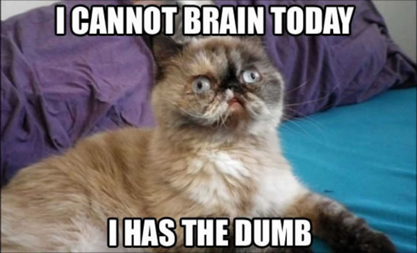
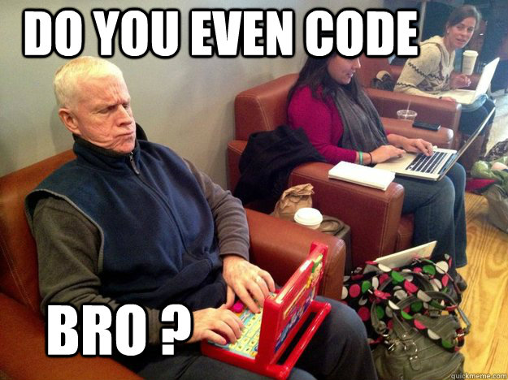
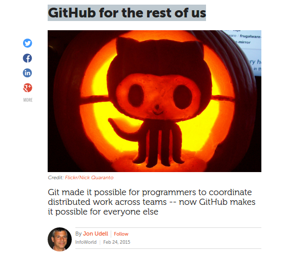
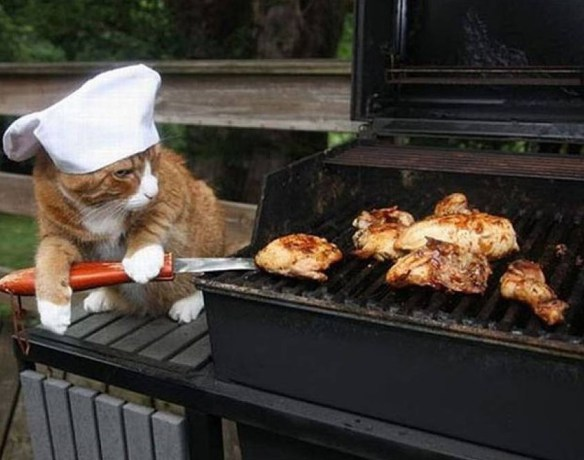
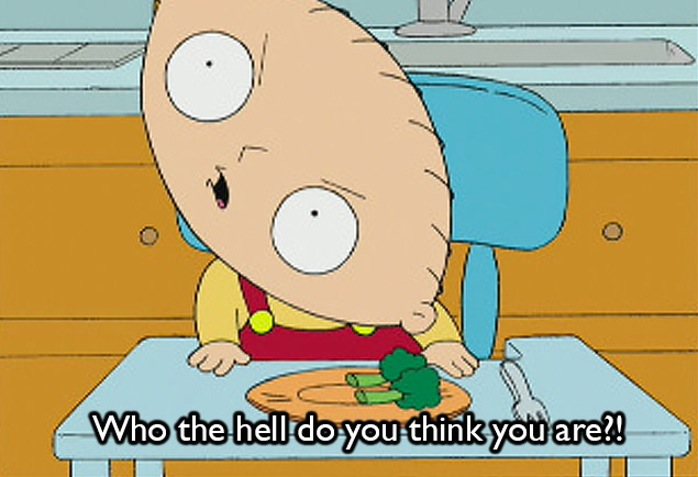

## Outline
>- I don't `git` `git`, why should I do this?
>- Working with a remote repository --  `GitHub`  
>- Working with a local repository -- `git`
>- Version control *basics* -- reviewing file histories

##I don't `git` it, why should I do this?
> - Version control -- because you *will* screw something up.
> - Collaboration -- because *everything* is better together.
> - Remote backup -- because your computer *will* die.
> - Public portfolio -- because you *should* demonstrate your 
awesomeness to the world.
>- Encourages reproducibility and creativity.

```{r, out.width = "200px", fig.align='center', echo=FALSE}
knitr::include_graphics("images/Octocat.png")
```


##What if people look at my code and think I'm dumb?
```{r, out.width = "200px", fig.align='center', echo=FALSE}

```


## What if people look at my code and think I'm dumb?
```{r, out.width = "200px", fig.align='center', echo=FALSE}
knitr::include_graphics("images/Notime.jpg")
```


## I'm not really a coder
```{r, out.width = "200px", fig.align='center', echo=FALSE}

```


## You are, but even if you're "not"
"GitHub is used to manage the collaborative development of recipes, musical scores, books, fonts, legal documents, lessons and tutorials, and data sets"
```{r, out.width = "200px", fig.align='center', echo=FALSE}

```


# Working with a remote repository -- `GitHub` (or `BitBucket`)


##Let's make a `GitHub` log-in and repository!
```{r, out.width = "200px", fig.align='center', echo=FALSE}

```


# Working with a local repository -- `git`

## Enter the matrix
```{r, out.width = "200px", fig.align='center', echo=FALSE}
knitr::include_graphics("images/matrix.jpg")
```


## Clone your new remote repo
```{r, engine="bash", eval = FALSE}
git clone https://github.com/octocat/lovecatz.git
```
Now make some changes to your README.md on your computer,
or create a new file. Perhaps `hello.cpp` if you're feeling real crazy.


##Git used to it -- the basics
You've made some local repo edits to some code or documentation, what now?
```{r, engine="bash", eval = FALSE}
#See what's changed
git status

#prepare the content for the next commit -- "staging"
git add --all # --all, or specify files

#"The Rub" -- Record changes to the repository
#This is what creates version control
git commit -m "short discription of code changes"

#sync local and remote repos
git push -u origin master 
```

##Error!
```{r, engine="bash", eval = FALSE}
git config --global user.name "Octocat69"
git config --global user.email "Octocat69@bbqchikn.com"
```

```{r, out.width = "200px", fig.align='center', echo=FALSE}

```

## Back on track
```{r, engine="bash", eval = FALSE}
#sync local and remote repos
git push -u origin master 

#Up to date?
git status
```
Check out remote GitHub repo to see updates.


## Practice the "add, commit, push" cycle 4X
```{r, out.width = "200px", fig.align='center', echo=FALSE}

```
add, commit, push

add, commit, push

add, commit, push

add, commit, push


# Version control basics -- reviewing file histories
